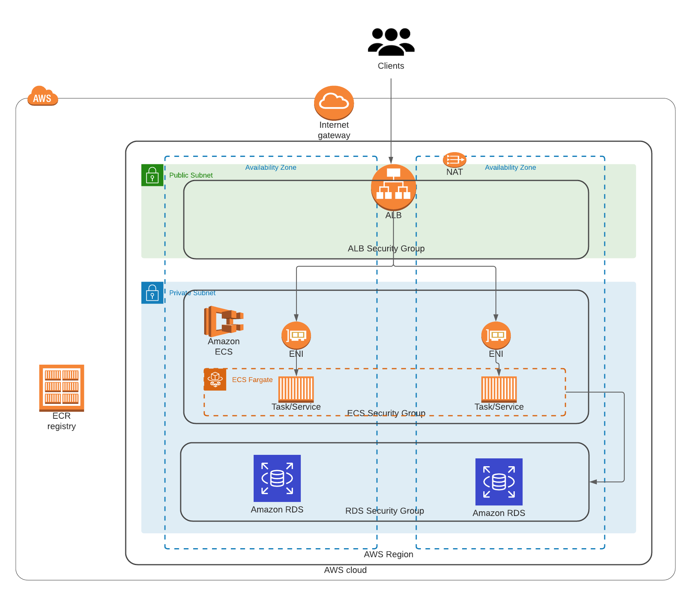

## Summary

This repo will create a full VPC (optional), ECR, ALB, ECS, and RDS environment. Completed with the following modules:
  - vpc (optional - you can update and use yours)
  - ecr
  - ecs (fargate based)
  - ecs (ec2 based)
  - alb
  - iam (for ecs)
  - rds
  - security_groups

  ## Basic Architecture

  


## Built with:

* Terraform (v0.14.0)
* AWS_ACCESS_KEYS and AWS_SECRET_ACCESS_KEYS are set as environment variables (link: https://docs.aws.amazon.com/cli/latest/userguide/cli-configure-envvars.html)

### Step by Step deployment
* **Step 1: Clone the Repo**. This command will clone the repo and will change directory the recently cloned repo
```shell script
$ git clone https://github.com/antonio-rufo/tf-adebiyidevops.git
```


* **Step 2: Create a S3 bucket for remote state storage.** Update the `terraform.tfvars` file with your account ID and region and environment
```shell script
$ cd tf-mdjedaini
$ cd statebucket
$ vi terraform.tfvars
```
Create the resources:
```shell script
$ terraform init
$ terraform plan
$ terraform apply --auto-approve
```
Take note of the output for `state_bucket_id`. You'll need to update the `main.tf` on each layer with it. It is not yet possible to have the state bucket values interpolated.  


* **Step 3.A: Create your ECS FARGATE environment.** Update the `terraform.tfvars` file with your account ID, region, and environment. Then fill up all required variables (ex. ACM SSL ARN required by ALB). Then update `main.tf` with the **state_bucket_id** created in step 2 (line 13) as well as the **region** (line 15).
```shell script
$ cd ../environment-fargate
$ vi terraform.tfvars
$ vi main.tf
```
Create the resources:
```shell script
$ terraform init
$ terraform plan
$ terraform apply --auto-approve
```

* **Step 3.B: Create your ECS EC2 environment.** Update the `terraform.tfvars` file with your account ID, region, and environment. Then fill up all required variables (ex. ACM SSL ARN required by ALB). Then update `main.tf` with the **state_bucket_id** created in step 2 (line 13) as well as the **region** (line 15).
```shell script
$ cd ../environment-fargate
$ vi terraform.tfvars
$ vi main.tf
```
Create the resources:
```shell script
$ terraform init
$ terraform plan
$ terraform apply --auto-approve
```
